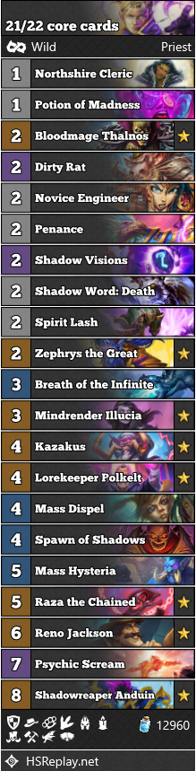
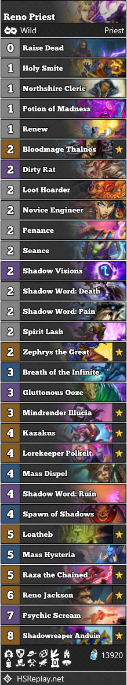
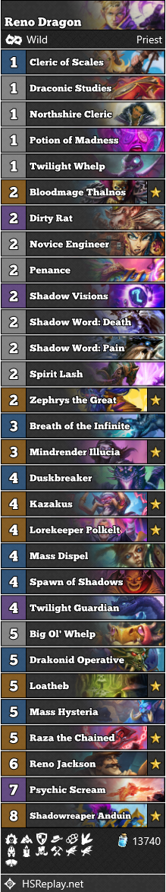

# Reno Priest Guide

## Deck description

## How to build the deck?
### Start by including all the core cards.
This deck has 22 core cards.

|For the 22th card you need to make a choice:|
|:---:|
|Forbidden Words|
|Shadow Word: Pain|

### Choose your package
After, choose a package. There are two packages right now: the normal and the dragon. Togwaggle and Gadgetzan  packages are okay but aren't the bests. Velen and Quest packages are not good in this meta.
|Normal|Dragon|
|:--:|:---:|
|Raise Dead|Cleric of Scales|
|Holy Smite|Draconic Studies|
|Renew|Duskbreaker|
|Loot Hoarder|Big Ol'Whelp|
|Seance|Drakonid Operative|
|Gluttonous Ooze|Dragonfire Potion|

### Then, make some choices
|You can add the other one, or not|
|:---:|
|Forbidden Words|
|Shadow Word: Pain|

|Do you see few aggro decks?|
|:---:|
|Add Loatheb|

|Choose the last card in the normal version|why?|
|:---|---:|
|Sphere of Sapience||
|Mo'arg Artificier|Great with Holy Smite, Spirit Lash and Holy Nova, great vs Aggro|
|Holy Nova|Great vs Aggro|
|Shadow Word: Ruin|Great vs Warlock|

|Choose the last card in the dragon version|why?|
|:--:|:--:|
|Raise Dead||
|Holy Nova|Great vs Aggro|
|Sphere of Sapience||
|Twilight Whelp|Hold a Dragon. Great vs Aggro|

### Flexible cards
|Normal|Dragon|
|:--:|:---:|
|Renew|Forbidden Words or Shadow Word: Pain|
|Breath of the Infinite|           Draconic Studies           |
|Gluttonous Ooze|          Twilight Guardian           |
||Mass Hysteria or Dragonfire Potion|

### Possible cards
|Normal|Dragon|
|:--:|:---:|
|Golakka Crawler|Renew|
|   Acolyte of Pain   |Manafeeder Panthara|
|Kobold Stickyfinger| Acidic Swamp Ooze or Gluttonous Ooze |
|Zilliax|           Acolyte of Pain            |
|Emperor Thaurissan|             Platebreaker             |
|Jepetto Joybuzz|               Zilliax                |

### Other cards
The past versions of the normal deck had Dragonfire Potion or Soul Mirror. Now, because of Lorekeeper Poleklt, the deck has become really more aggressive: we don't have one turn to lose after we play him. We need to have Raza the Chained and Spawn of Shadows as soon as possible.

You can consider Brann Bronzebeard. If you do, you can consider Coldlight Oracle, Zola the Gorgon and/or Cobalt Spellkin too,

You can consider Witchwood Piper: you need to remove every 1-mana and 2-mana minions but Zephrys the Great. It is not recommended if you see lot of aggro decks

## Building the deck: Budget to Final
I recommend you to build the Dragon Budget version because dragons are cheap and strong.
If you don't have Cleric of Scales you can replace it with Manafeeder Panthara.

### Budget

AAEBAa0GHvsBlwKcAskGigfTCtYK1wryDPsM7hH3E4O7ArW7Arq7AvDPApDTAsvmAuj5ApeHA+aIA5ibA5mpA/KsA+ewA4exA5i2A5O6A93MA97MAwAA

### Semi Budget
Raise Dead is not necessary here, you can keep Renew.

AAEBAa0GHvsBlwKcAtMK1grXCvIM+wzuEfcTwxaDuwK1uwK6uwLYuwLwzwLo0AKQ0wLL5gKXhwOYmwP8owOZqQPyrAPnsAOYtgPdzAPezAPXzgP21gMAAA==

### Standard to Wild
If you are a Standard player you need to craft Raza and Anduin to play the deck. This is a possible version you can run when you have them (I assume that you have all the Standard legendaries):

AAEBAa0GHvsBlwKcAu0FyQbTCtYK1wryDO4R9xODuwK1uwK6uwLwzwKQ0wLL5gKXhwPmiAP8owOZqQPyrAPnsAOYtgOTugPdzAPezAP70QOm1QP21gMAAA==

### Priority order
Zephrys the Great, Reno Jackson and Kazakus are the first cards to have: that's why we play highlander! You can craft Psychic Scream before Kazakus if you see lots of Mirror matchups.
Psychic Scream and Shadow Visions are the most important spells in the deck.
Lorekeeper Polkelt is a new core card because it gives us our combo faster. You can craft him before Psychic Scream if you don't see lots of Mirror matchups and before Shadow Visions if you don't see lots of Aggro matchups.
Mindrender Illucia is the next card to craft because it's our Win Condition versus combo decks. If you have 400 dust, you can craft Dirty Rat before.
Dirty Rat and Loatheb are the last cards to craft, they are really specific tech cards.
Finish with Gluttonous Ooze, you can always play Acidic Swamp Ooze or Kobold Stickyfinger instead.

## Mulligan and Matchups
### Demon Hunter
Assume the opponent is playing Odd.

Odd and Aggro. You need to mulligan for small removal spells (0, 1, 2 or 3 mana), Gluttonous Ooze, Zephrys the Great, Cleric of Scales, Northshire Cleric, Twilight Whelp, Duskbreaker, Shadow Visions or Renew (only if you have another removal in hand), Holy Nova and Zilliax if you have The Coin, keep Mo'arg or Thalnos if you have Spirit Lash or Shadow Visions. Don't keep any card that costs more than 4 mana.
The strategy is simple: you need to control the opponent. You win when you controlled all his board.

### Druid
Assume the opponent is playing Malygos but keep one small removal in case.

Odd and Aggro. You need to mulligan for small removal spells (0, 1, 2 or 3 mana), Zephrys the Great, Cleric of Scales, Northshire Cleric, Twilight Whelp, Duskbreaker, Shadow Visions or Renew (only if you have another removal in hand), Holy Nova, Mass Dispell and Zilliax if you have The Coin, keep Mo'arg or Thalnos if you have Spirit Lash or Shadow Visions. Don't keep any card that costs more than 4 mana.
The strategy is simple: you need to control the opponent. You win when you controlled all his board. Be careful with Dirty Rat, don't play him after the oponent plays Embiggen.

Jade. Mulligan for Draw and your combo pieces (Polkelt, Raza and Anduin). Easy matchup, just be careful of Naturalize! Don't be afraid of the armour if you are not playing with Dragons. Just use Seance on Spawn of Shadows and kill him over three turns (first turn Spawn of Shadows and Seance, second turn Reno Jackson and any big card that does not contribute to the Spawn of Shadows turn, third turn Spawn of Shadows again), the turns don't need to be consecutive, you can wait some turns to collect more cards for the third combo. If you have Skullking Geist, just find him: if you play him you win.

Malygos, Togwaggle and Linecracker. Mulligan for Dirty Rat, Mindrender Illucia, Zephrys the Great or Draw. You just need to Dirty Rat or Mindrender Illucia in the good moment. That moment is after he plays Juicy Psychmelon, Emperor Thaurissan, or when you think he will combo next turn. The deck is easy to beat, you just need to have those two cards. So, DON'T use Lorekeeper Polkelt, it is hard to win by using your combo, **normally** Druid's combo is faster. Try to make a lot of pressure, so play Animal Companion (Zephrys) and don't be scared of playing Spawn of Shadows on turn 4.

### Hunter
Assume the opponent is playing Even.

Even and Odd. You need to mulligan for small removal spells (0, 1, 2 or 3 mana), Zephrys the Great, Cleric of Scales, Northshire Cleric, Twilight Whelp, Duskbreaker, Shadow Visions or Renew (only if you have another removal in hand), Holy Nova and Zilliax if you have The Coin, keep Mo'arg or Thalnos if you have Spirit Lash or Shadow Visions. Don't keep any card that costs more than 4 mana. You can keep Reno Jackson in the Odd Hunter matchup, but if you don't know what's the Hunter deck the opponent is playing, don't keep him (unless you have The Coin).
The strategy is simple: you need to control the opponent. You win when you controlled all his board.

Reno. 

### Mage
Assume the opponent is playing Quest.

Secret.

Quest and RQM. 
If you Zephrys to destroy Ice Block, I recommend you to play Mindrender Illucia after to prevent the opponent's Reno Jackson.

RGM.
If you Zephrys to destroy Ice Block, I recommend you to play Mindrender Illucia after to prevent the opponent's Reno Jackson.

### Paladin
Assume the opponent is playing Mech Handbuff.

Mech Handbuff.

Libram.

Murloc and Aggro. You need to mulligan for small removal spells (0, 1, 2 or 3 mana), Zephrys the Great, Cleric of Scales, Northshire Cleric, Twilight Whelp, Duskbreaker, Shadow Visions or Renew (only if you have another removal in hand), Holy Nova and Zilliax if you have The Coin, keep Mo'arg or Thalnos if you have Spirit Lash or Shadow Visions. Don't keep any card that costs more than 4 mana.
The strategy is simple: you need to control the opponent. You win when you controlled all his board. 

OTK.

### Priest
Assume the opponent is playing Mirror.
If you have Plkelt, Raza and/or Anduin in your hand, you should play Wild Growth with Zephrys. This will help you making your combo before your opponent.

Mirror.

Combo.

### Rogue
Assume the opponent is playing Kingsbane.

Odd and Aggro. You need to mulligan for small removal spells (0, 1, 2 or 3 mana), Zephrys the Great, Cleric of Scales, Northshire Cleric, Twilight Whelp, Gluttonous Ooze, Duskbreaker, Shadow Visions or Renew (only if you have another removal in hand), Holy Nova and Zilliax if you have The Coin, keep Mo'arg or Thalnos if you have Spirit Lash or Shadow Visions. Don't keep any card that costs more than 4 mana.
The strategy is simple: you need to control the opponent. You win when you controlled all his board. You can Mindrender Illucia their Secret Passages.

Kingsbane. Same mulligan than Odd and Aggro Rogue.
You can Mindrender Illucia their Secret Passages.

### Shaman
Assume the opponent is playing Even.

Even. You need to mulligan for small removal spells (0, 1, 2 or 3 mana), Zephrys the Great, Cleric of Scales, Northshire Cleric, Twilight Whelp, Duskbreaker, Shadow Visions or Renew (only if you have another removal in hand), keep Thalnos if you have Spirit Lash or Shadow Visions. Shadow Word: Ruin is worth keeping. Don't keep any card that costs more than 4 mana.
The strategy is simple: you need to control the opponent. You win when you controlled all his board. 

Odd, Totem and Overload. You need to mulligan for small removal spells (0, 1, 2 or 3 mana), Zephrys the Great, Cleric of Scales, Northshire Cleric, Twilight Whelp, Duskbreaker, Shadow Visions or Renew (only if you have another removal in hand), Holy Nova and Zilliax if you have The Coin, keep Mo'arg or Thalnos if you have Spirit Lash or Shadow Visions. Don't keep any card that costs more than 4 mana.
The strategy is simple: you need to control the opponent. You win when you controlled all his board. 

Reno.

### Warlock
Assume the opponent is playing Zoo.

Zoo, Even and Discard. You need to mulligan for small removal spells (0, 1, 2 or 3 mana), Zephrys the Great, Cleric of Scales, Northshire Cleric, Twilight Whelp, Duskbreaker, Shadow Visions or Renew (only if you have another removal in hand), keep Thalnos if you have Spirit Lash or Shadow Visions. Shadow Word: Ruin is worth keeping. Don't keep any card that costs more than 4 mana.
The strategy is simple: you need to control the opponent. You win when you controlled all his board. 

Cube.

Reno. Be careful of Gnomeferatu after you play Lorekeeper Polkelt.

### Warrior
Assume the opponent is playing Pirate.

Pirate, Bomb and Galakrond. You need to mulligan for small removal spells (0, 1, 2 or 3 mana), Zephrys the Great, Cleric of Scales, Northshire Cleric, Twilight Whelp, Gluttonous Ooze, Duskbreaker, Shadow Visions or Renew (only if you have another removal in hand), Holy Nova and Zilliax if you have The Coin, keep Mo'arg or Thalnos if you have Spirit Lash or Shadow Visions. Don't keep any card that costs more than 4 mana.
The strategy is simple: you need to control the opponent. You win when you controlled all his board. Versus Bomb Warrior or if your opponent has Wrenchcalibur you NEED to play Zephrys, Kazakus, Raza and Reno ASAP. Without their Battlecry those minions are useless. Be careful with the Bombs and Lorekeeper Polkelt.

Dead Man's Hand.

Odd. If you are playing with Dragons make a lot of pressure with them. If not, or if the opponent has a lot of armour, don't be afraid of it! You just need to be careful of the Brann+Oracle combo and  play the three turn combo as I explained in the Jade Druid guide. Save your Potion and Silence spells for Deathlord.

## General tips
Versus Aggro don't play Lorekeeper Polkelt too early. You need your small removal spells versus Aggro, if you play Polkelt early, like on turn 4, you will loose your next two turns (because you will clearly play Psychic Scream on turn 7). Be careful! If you don't have lot's of little spells in your hand, don't play him.

Psychic Scream shuffles your opponent deck. You can always play it on an empty board after your opponent plays Lorekeeper Polkelt to shuffle his deck!

If you play Mindrender Illucia and your opponent has Psychic Scream in hand don't forget that all the minions will be shuffles in YOUR deck.

Versus Aggro don't keep Zephrys for a Brawl or a big spell. You can play him on turn 2 to Backstab an enemy minion :) It is okay!

Illucia is no longer good versus Aggro, but if you have expensive cards in hand you should play her early versus Aggro! It will prevent the opponent of playing his next turn. Try to burn as many cards as you can when you play her.

Kazakus potions.
Versus Aggro: if you can play it now you should go for the 1 mana potion, try to search the 2 damage to every minion and the 3 damage face. Freeze is okay. Draw can be good if you already have the 2 damage to every minion. If you can't play it now, you should take the 5 mana potion and take the same things that the 1 mana potion.
Versus Combo: the 1 mana potion with draw and face damage or the add-a-random-demon are the best. If you need to clean the board you can go for the five mana potion.
If Anduin and Polkelt are your last cards in your deck and you are playing versus Jade Druid or Cube Warlock, you should go for the 10 mana potion to control the board.

How to count Spawn of Shadows damage?
2 + 6(this is when you play Spawn of Shadows) + 6 for every other card you play. So, 6 times 5 = 30, 30+2 = 32. If you play Spawn of Shadows and four other cards you can make 32 damage.

## Deck codes
### Normal version

AAEBAa0GHvsBlwKcAu0F0wrWCtcK8gz6DvcTwxaDuwK1uwLYuwLRwQLfxALTxQLwzwLo0AKQ0wKXhwPmiAP8owOZqQPyrAOTugPXzgP70QOm1QP21gMAAA==
### Dragon version

AAEBAa0GHpwC7QXTCtYK1wryDPoO7hH3E8MWg7sCtbsCursC2LsC6r8C0cEC38QC8M8C6NACkNMCy+YCl4cD/KMDmakD8qwD57ADmLYD3swD+9ED9tYDAAA=
### Togwaggle version

### Gadgetzan version

### Velen version

### Quest N'zoth version

### Quest version

## Contact
You can contact me on my Twitter account.